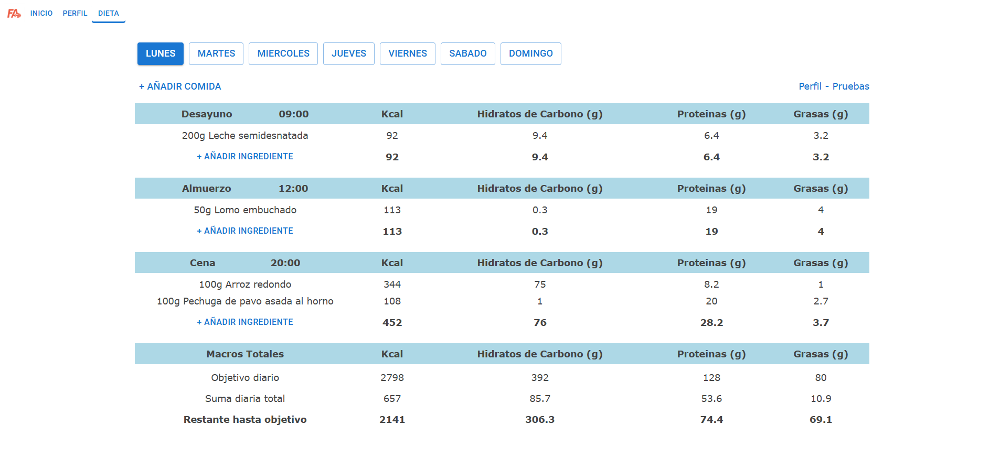

# 🏆 Fitness App

A responsive web application that allows users to create their personal diets according to their goals.  
> 🖥️📱 This project is compatible with both desktop and mobile/touch devices.

---

## 🎯 Description

This project was built **from scratch** as part of my personal learning journey in software development.  
It helped me strengthen my knowledge of:

- React
- Material UI
- JavaScript (ES6+)
- Component-based UI design
- Fetch API

---

## 📝 How to Use

1. Create your **personal profile**.
2. Set your data on **profile section** to **calculate your daily macros needs**.
3. Create your diet on **diet section** by **adding meals and ingredients** to each day of the week.
4. When clicking **+ AÑADIR INGREDIENTE** you will have three options:
      -  Search directly in an **initial application database**.
      -  Search in **openfoodfacts** by the term in the search bar.
      -  **Create your own ingredient**
5. Searched ingredients in openfoodfacts and created ingredients will be saved in the application database for next times (localStorage).
6. At the end of each table will be a section showing **the remaining needs to reach the daily goal**.

Start your fitness journey today!

---

## 🛠️ Technologies Used

- React
- Material UI
- JavaScript (Vanilla + JSX)
- Vite
- Fetch API

---

## ⚠️ Requirements

- Fully responsive: works perfectly on **desktop and mobile devices**
- Best experienced on **Chrome** or **Firefox**

---

## 👨‍💻 Author

Developed by **Jose Angel Gil**  
GitHub: [@joseangelgil](https://github.com/joseangelgil)

---

## 📷 Screenshot

